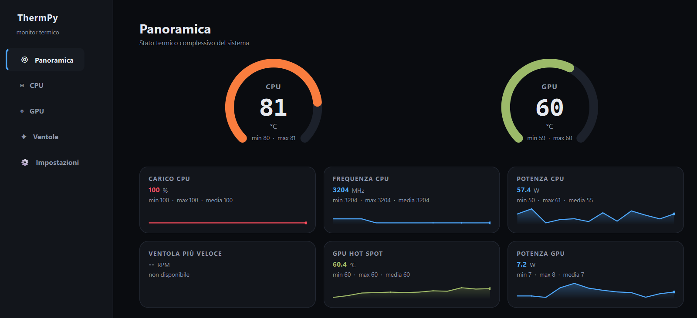
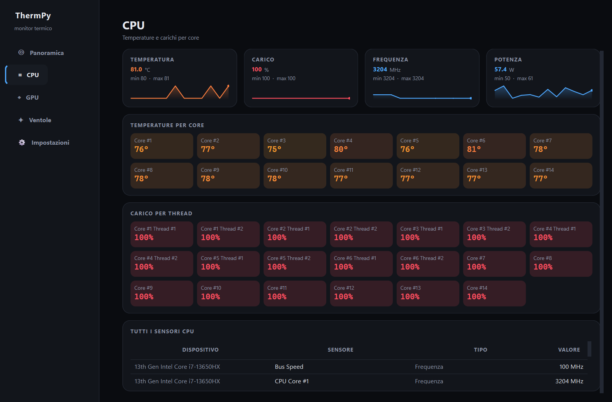
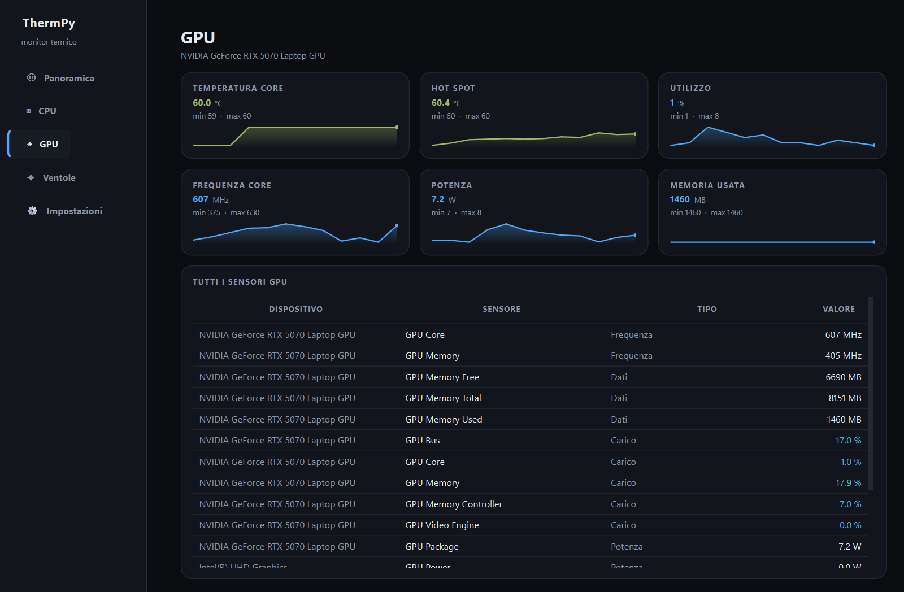
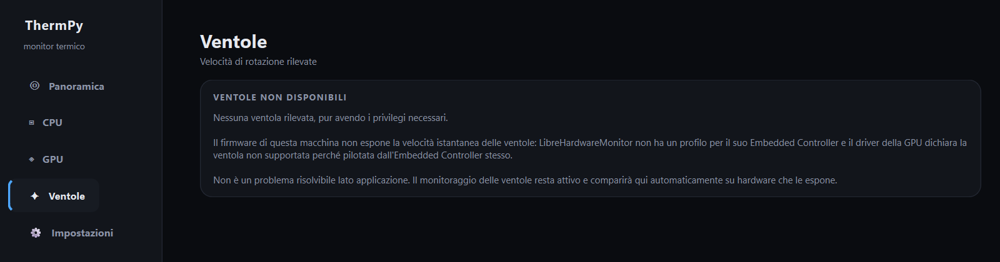
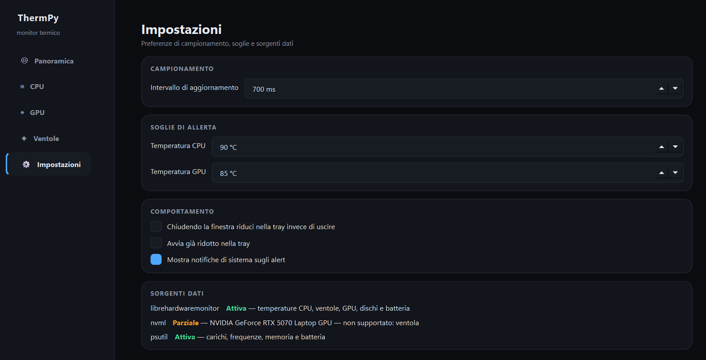
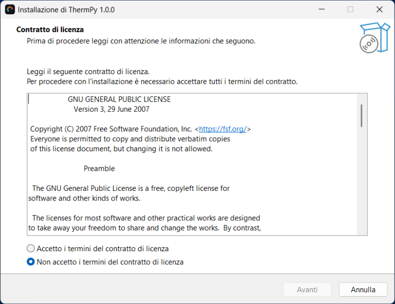

# ThermPy

**Monitor di temperature, ventole e carichi per Windows**

Temperature CPU per-core, GPU con hot spot, RPM delle ventole, frequenze, potenza
assorbita, dischi e batteria — tutto in tempo reale, in una finestra sola.

---

## Panoramica

Due gauge per il colpo d'occhio, sotto le metriche che contano con il loro
andamento recente. Il colore non è decorativo: la stessa scala teal → ambra →
rosso descrive lo stato termico ovunque compaia, dai gauge alle celle dei core
fino all'icona nella barra delle applicazioni.

## CPU

Tutte e quattordici le temperature per-core, il carico dei venti thread logici,
frequenza e potenza di package. La heatmap rende immediato individuare il core più
caldo senza leggere un numero alla volta.

## GPU

Temperatura core e hot spot, utilizzo, frequenze, potenza assorbita e memoria
video, con la tabella completa dei sensori grezzi.

## Ventole

Una card per ventola con RPM correnti e storico. Quando gli RPM non ci sono,
ThermPy dice **perché**: distingue "mancano i privilegi di amministratore" da "i
privilegi ci sono ma il firmware non li espone", invece di mostrare una pagina
vuota che sembra un difetto.

## Impostazioni

Intervallo di campionamento, soglie di allerta, comportamento della tray e — la
parte più utile quando qualcosa non torna — la diagnostica delle tre sorgenti
dati, ciascuna con il proprio stato e il motivo.

---

## Installazione

Scarica **[ThermPy-Setup-1.0.0.exe](dist/ThermPy-Setup-1.0.0.exe)** ed eseguilo.

L'installer richiede i privilegi di amministratore perché installa in
`C:\Program Files\ThermPy`. Crea il collegamento nel menu Start, opzionalmente
quello sul desktop, e registra la voce di disinstallazione in "App installate".

### Requisiti

- Windows 10 o 11, a 64 bit
- Privilegi di amministratore per l'uso quotidiano (vedi sotto)
- Nessun runtime da installare a parte: Python, Qt e il runtime .NET sono già
  inclusi nei 100 MB installati

---

## Perché chiede i privilegi di amministratore

Su Windows le temperature per-core della CPU si leggono dagli MSR del processore e
gli RPM delle ventole dall'Embedded Controller. Entrambi richiedono un driver
kernel, che a sua volta richiede un processo elevato. Non è una scelta di comodo:
dallo spazio utente quei dati non esistono e basta — `psutil.sensors_temperatures()`
su Windows restituisce sempre un dizionario vuoto.

L'eseguibile dichiara la richiesta nel proprio manifest, quindi Windows mostra il
prompt UAC **prima** di avviare l'applicazione, come per qualsiasi strumento di
diagnostica hardware.

## Le tre sorgenti dati

ThermPy non dipende da un'unica fonte: ne interroga tre e le fonde.

| Sorgente | Priorità | Fornisce |
|---|:---:|---|
| **LibreHardwareMonitorLib** via pythonnet | 9 | temperature CPU per-core, ventole, GPU completa, dischi, batteria |
| **NVML** (driver NVIDIA) | 5 | riserva per la GPU se il runtime .NET non parte |
| **psutil** | 1 | carichi, frequenze, memoria, batteria; sempre disponibile |

Le sorgenti si sovrappongono, quindi un arbitro elegge un vincitore per ogni coppia
*(dominio, grandezza)*. La granularità è la coppia e non il solo dominio per un
motivo concreto: senza privilegi LibreHardwareMonitor espone i carichi della CPU ma
non le temperature né i clock, e vincendo l'intero dominio sopprimerebbe la
frequenza che psutil sa fornire.

**Nessuna sorgente è obbligatoria.** Se una cade, l'applicazione parte lo stesso con
ciò che resta e lo dichiara nella pagina Impostazioni.

## Sulle ventole, senza girarci intorno

Sul portatile su cui ThermPy è stato sviluppato (Lenovo `LNVNB161216`, i7-13650HX +
RTX 5070 Laptop) **la velocità istantanea delle ventole non è ottenibile**, nemmeno
da amministratore. Le tre strade sono state verificate una per una:

| Via | Esito |
|---|---|
| LibreHardwareMonitor | La motherboard non espone né SuperIO né Embedded Controller: nessun profilo per questo modello |
| NVML | `NVML_ERROR_NOT_SUPPORTED`, `num fans = 0` — la ventola della GPU è pilotata dall'EC |
| WMI Lenovo | `LENOVO_FAN_TABLE_DATA` e `LENOVO_FAN_TEST_DATA` espongono curve, limiti e `NumOfFans = 2`, ma nessuna velocità corrente |

È un limite del firmware, non del programma: la lettura delle ventole è
implementata per intero e la pagina si popola da sola su hardware che le espone,
come i desktop con SuperIO e molti altri portatili.

---

## Cosa c'è dentro

Interfaccia in **Qt 6** tramite PySide6, disegnata a mano: gauge radiali, sparkline
e heatmap sono `QPainter` su ring buffer, senza matplotlib né pyqtgraph. Il
campionamento dei sensori vive su un thread dedicato — `Update()` di
LibreHardwareMonitor blocca per decine di millisecondi, e sul thread della UI
produrrebbe micro-scatti a ogni tick.

Anche l'icona è codice: un arco a gradiente termico disegnato dalla stessa scala di
colore dei gauge, compilato in un `.ico` a sette risoluzioni.

Il pacchetto contiene solo i moduli Qt effettivamente usati: quelli per QML, PDF,
rete e il rasterizzatore OpenGL software sono esclusi, il che dimezza quasi lo
spazio occupato rispetto a una build predefinita.

## Licenza e componenti di terze parti

ThermPy è **gratuito**, per uso personale e commerciale, e ridistribuibile purché
l'installer resti immutato. I termini completi sono in **[LICENSE](LICENSE)**.

Incorpora Qt sotto **LGPL-3.0**: le librerie Qt sono file separati e sostituibili
in `_internal\PySide6\`, come la licenza richiede. L'elenco di tutti i componenti,
i testi integrali delle licenze e le istruzioni per esercitare i diritti previsti
dalla LGPL sono in **[THIRD-PARTY.md](THIRD-PARTY.md)**.

## Disinstallazione

Da *Impostazioni → App installate → ThermPy*, oppure dal collegamento
*Disinstalla ThermPy* nel menu Start.

Le preferenze restano in `HKCU\Software\ThermPy` e i log in
`%LOCALAPPDATA%\ThermPy`: occupano pochi kilobyte e permettono di ritrovare la
configurazione dopo una reinstallazione. Si cancellano a mano se non servono.

---

ThermPy 1.0.0 · gratuito · Qt sotto LGPL-3.0

